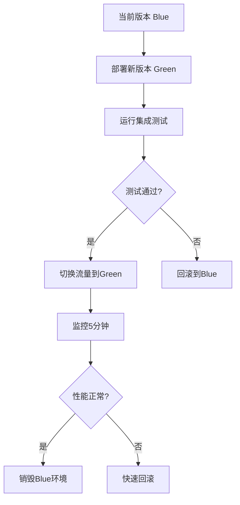

# 🚀 GitHub Actions CI/CD 工作流

## 📋 工作流总览

本项目实现了完整的9阶段CI/CD流水线，严格遵循GitHub社区最佳实践，确保代码质量和部署可靠性。

## 🎯 工作流列表

### 1. 🚀 CI/CD 主流水线 (`ci-cd.yml`)

**触发条件**: Push到main/develop分支、PR创建/更新、手动触发

**功能**: 完整的CI/CD流程，包含所有9个验证阶段

**阶段**:

- 1️⃣ 本地验证 - 依赖安装和构建检查
- 2️⃣ 自动化测试 - 单元测试和覆盖率分析
- 3️⃣ 安全检查 - 依赖审计和漏洞扫描
- 4️⃣ 集成测试 - 服务间通信验证
- 5️⃣ PR审核 - 代码质量门禁 (仅PR)
- 6️⃣ Staging部署 - 分支环境自动部署
- 7️⃣ 回归测试 - 历史功能完整性验证
- 8️⃣ 生产部署 - 蓝绿部署策略
- 9️⃣ 监控回溯 - 实时监控配置

### 2. 🔍 PR质量审查 (`pr-review.yml`)

**触发条件**: PR打开、同步、重新打开、审查提交

**功能**: PR质量检查、自动反馈、门禁控制

**特性**:

- 代码质量评分 (100分制)
- 自动PR反馈评论
- 大小检查和标签
- 必需审批控制

### 3. 📦 依赖安全检查 (`dependency-check.yml`)

**触发条件**: 每周一定时、手动触发、依赖文件变更

**功能**: 依赖安全审计、许可证合规、过时包检查

**检查内容**:

- npm audit 安全漏洞
- 许可证兼容性分析
- 过时依赖检测
- 自动安全问题创建

### 4. 📈 性能监控 (`performance-monitoring.yml`)

**触发条件**: 每天定时、手动触发、前端代码变更

**功能**: 性能监控、负载测试、回归检测

**监控指标**:

- Lighthouse 性能评分
- 包大小分析
- k6 负载测试
- 运行时性能监控

## ⚙️ 配置要求

### 🔑 必需的Secrets

```bash
# GitHub Repository Secrets
GITHUB_TOKEN          # 自动提供，用于PR操作
AWS_ACCESS_KEY_ID     # AWS访问密钥 (生产部署需要)
AWS_SECRET_ACCESS_KEY # AWS密钥 (生产部署需要)
SLACK_WEBHOOK_URL     # Slack通知 (可选)
```

### 🌐 环境变量

工作流使用以下环境变量 (在工作流文件中定义):

```bash
NODE_VERSION=20.x
PNPM_VERSION=9.x
REGISTRY=ghcr.io
IMAGE_NAME=your-repo-name
```

## 🎯 分支策略

### Git Flow 工作流

```
main (生产分支)
├── develop (开发主分支)
│   ├── feature/* (特性分支)
│   ├── fix/* (修复分支)
│   └── refactor/* (重构分支)
└── hotfix/* (热修复分支)
```

### 分支触发规则

| 分支模式    | 触发工作流 | 部署环境   | 要求         |
| ----------- | ---------- | ---------- | ------------ |
| `feature/*` | ci-cd.yml  | 无         | 通过所有测试 |
| `develop`   | ci-cd.yml  | staging    | 通过回归测试 |
| `main`      | ci-cd.yml  | production | 通过所有检查 |
| `hotfix/*`  | ci-cd.yml  | production | 紧急修复     |

## 🛡️ 质量门禁

### PR 合并要求

PR合并到main分支前必须满足:

- ✅ **代码质量**: ESLint 0错误
- ✅ **类型安全**: TypeScript编译通过
- ✅ **测试覆盖**: ≥80% 行覆盖率
- ✅ **安全检查**: 无高危漏洞
- ✅ **质量评分**: ≥80分 (100分制)

### 自动检查清单

- [x] 单元测试通过
- [x] 集成测试通过
- [x] 安全扫描通过
- [x] 代码审查完成
- [x] CI/CD流水线通过

## 📊 监控和告警

### 自动通知

**成功通知**:

- ✅ Staging部署成功 → Slack通知
- ✅ 生产部署成功 → Slack通知 + GitHub PR评论

**失败告警**:

- ❌ 构建失败 → GitHub状态检查失败
- ❌ 测试失败 → GitHub状态检查失败
- ❌ 安全漏洞 → GitHub Issue自动创建
- ❌ 性能回归 → GitHub Issue自动创建
- ❌ 部署失败 → Slack告警 + 回滚通知

### 监控指标

**代码质量指标**:

- 测试覆盖率趋势
- ESLint错误数量
- TypeScript错误数量
- 构建成功率

**性能指标**:

- Lighthouse评分趋势
- 包大小变化
- 负载测试结果
- API响应时间

**安全指标**:

- 依赖漏洞数量
- 安全审计评分
- 许可证合规性

## 🚀 部署策略

### 蓝绿部署 (生产环境)



### 部署环境

**Staging环境**:

- 分支: `develop`
- 目的: 集成测试和验收
- 保留期: 最新3个部署
- 自动清理: 7天后

**Production环境**:

- 分支: `main`
- 目的: 生产服务
- 高可用: 99.9% SLA
- 备份策略: 每日备份

## 🔧 故障排除

### 常见问题

**Q: 工作流不触发?**
A: 检查分支保护规则和触发条件

**Q: 依赖安装失败?**
A: 检查PNPM缓存和Node.js版本

**Q: 部署失败?**
A: 验证AWS凭据和Docker镜像

**Q: 测试超时?**
A: 检查数据库连接和服务启动时间

### 调试技巧

1. **查看工作流日志**: Actions → [工作流名称] → 查看详细日志
2. **本地测试**: 使用`act`工具本地运行工作流
3. **逐步调试**: 在工作流中添加`echo`语句输出调试信息
4. **环境验证**: 使用`env`命令检查环境变量

## 📈 优化建议

### 性能优化

- 使用缓存: `actions/cache`缓存依赖
- 并行执行: 合理安排Job依赖关系
- 资源分配: 根据需求调整runner规格
- 增量构建: 只构建变更的部分

### 成本优化

- 定时任务: 合理安排监控频率
- 条件执行: 只在必要时运行昂贵检查
- 资源清理: 及时清理临时资源
- 缓存策略: 优化缓存命中率

### 可靠性提升

- 重试机制: 对不稳定步骤添加重试
- 超时控制: 设置合理的超时时间
- 回滚策略: 准备好回滚方案
- 监控告警: 完善监控和告警体系

## 📚 相关文档

- [GitHub Actions 文档](https://docs.github.com/actions)
- [项目README](../README.md)
- [贡献指南](../CONTRIBUTING.md)
- [安全指南](../SECURITY.md)

---

_最后更新: 2025年11月8日_ • _遵循GitHub社区最佳实践_ ⭐
