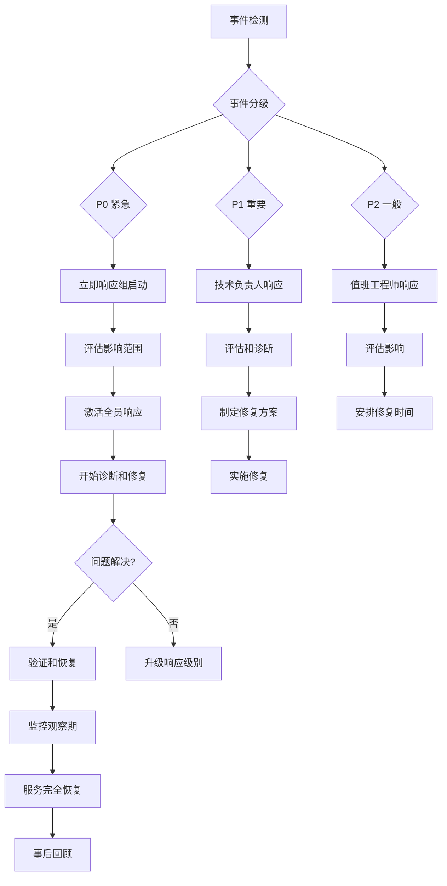

# 🚨 应急响应手册

**项目名称**: 创世星环 AI 游戏创作平台
**版本**: v1.0
**最后更新**: 2025年11月5日

---

## 📋 目录

1. [事件分级标准](#事件分级标准)
2. [响应流程总览](#响应流程总览)
3. [P0 紧急事件处理](#p0-紧急事件处理)
4. [P1 重要事件处理](#p1-重要事件处理)
5. [P2 一般事件处理](#p2-一般事件处理)
6. [常见故障处理](#常见故障处理)
7. [通信模板](#通信模板)
8. [事后回顾](#事后回顾)

---

## 🎯 事件分级标准

### P0 - 紧急 (Critical)
**响应时间**: < 15分钟
**影响范围**: 大面积用户受到影响

- 生产环境完全不可用
- 数据库完全不可访问
- 安全入侵事件
- 数据丢失或损坏
- 核心业务流程中断

### P1 - 重要 (Major)
**响应时间**: < 1小时
**影响范围**: 部分用户或功能受到影响

- 核心功能部分不可用
- 性能严重下降 (>50%)
- 高危安全漏洞
- 重要数据不一致
- 关键依赖服务故障

### P2 - 一般 (Minor)
**响应时间**: < 4小时
**影响范围**: 有限用户或轻微功能影响

- 非核心功能异常
- 性能轻微下降 (<50%)
- 监控告警异常
- 用户体验轻微下降

---

## 🔄 响应流程总览



---

## 🚨 P0 紧急事件处理

### 检测阶段 (< 5分钟)
1. **监控告警触发**
   - 检查告警详情和影响范围
   - 确认事件级别 (P0)

2. **立即通知**
   - 拨打应急电话或发送短信
   - Slack #emergency 频道通知
   - 电话通知关键人员

### 响应阶段 (< 15分钟)
1. **启动应急响应小组**
   ```
   指挥官: 技术总监
   技术负责人: 架构师
   执行人员: 资深工程师 x 2
   支持人员: DBA、运维工程师
   沟通人员: 产品经理
   ```

2. **建立指挥中心**
   - 创建Slack应急频道
   - 启动Zoom会议
   - 分配职责和时间表

3. **影响评估 (< 10分钟)**
   - 确定受影响的用户数量
   - 评估业务影响程度
   - 确定恢复时间目标 (RTO)
   - 确定数据恢复点目标 (RPO)

### 诊断阶段 (< 30分钟)
1. **收集信息**
   ```bash
   # 检查系统状态
   kubectl get pods -n tuheg-production
   kubectl get events -n tuheg-production --sort-by='.lastTimestamp'

   # 检查监控指标
   curl http://prometheus/api/v1/query?query=up

   # 检查日志
   kubectl logs -f deployment/backend-gateway -n tuheg-production
   ```

2. **确定根本原因**
   - 数据库连接问题
   - 服务崩溃
   - 网络故障
   - 配置错误
   - 代码缺陷

### 修复阶段 (< 60分钟)
1. **执行修复措施**
   ```bash
   # 选项1: 快速重启
   kubectl rollout restart deployment/backend-gateway -n tuheg-production

   # 选项2: 回滚部署
   ./deployment/rollback.sh backend-gateway production

   # 选项3: 流量切换
   kubectl patch ingress main-ingress -p '{"spec":{"rules":[]}}'
   ```

2. **验证修复效果**
   - 检查服务健康状态
   - 验证核心功能正常
   - 确认用户可以正常使用

### 恢复阶段 (< 30分钟)
1. **逐步恢复流量**
   - 1% 流量验证
   - 10% 流量验证
   - 50% 流量验证
   - 100% 流量恢复

2. **监控观察**
   - 30分钟核心监控
   - 2小时完整监控
   - 24小时业务监控

---

## ⚠️ P1 重要事件处理

### 响应流程
1. **事件确认 (< 30分钟)**
   - 技术负责人响应
   - 评估影响范围
   - 确定响应策略

2. **问题诊断 (< 1小时)**
   - 收集系统指标
   - 分析错误日志
   - 确定修复方案

3. **方案实施 (< 2小时)**
   - 执行修复措施
   - 验证修复效果
   - 准备回滚方案

4. **服务恢复**
   - 逐步恢复服务
   - 监控系统状态
   - 通知相关方

---

## ℹ️ P2 一般事件处理

### 响应流程
1. **事件记录**
   - 值班工程师响应
   - 评估影响程度
   - 确定处理优先级

2. **问题诊断**
   - 收集相关信息
   - 分析问题原因
   - 制定修复计划

3. **计划修复**
   - 安排合适的时间窗口
   - 执行修复措施
   - 验证修复效果

---

## 🔧 常见故障处理

### 数据库连接故障
```bash
# 1. 检查数据库状态
kubectl get pods -l app=postgres -n tuheg-production

# 2. 检查连接数
kubectl exec -it postgres-pod -- psql -c "SELECT count(*) FROM pg_stat_activity;"

# 3. 重启连接池
kubectl rollout restart deployment/backend-gateway

# 4. 如果需要，扩容数据库
kubectl scale deployment postgres --replicas=2
```

### 服务响应超时
```bash
# 1. 检查服务资源使用
kubectl top pods -n tuheg-production

# 2. 检查服务日志
kubectl logs -f deployment/backend-gateway -n tuheg-production

# 3. 扩容服务实例
kubectl scale deployment backend-gateway --replicas=5

# 4. 重启服务
kubectl rollout restart deployment/backend-gateway
```

### 高错误率
```bash
# 1. 检查错误模式
curl http://prometheus/api/v1/query?query=rate(http_requests_total{status=~\"5..\"}[5m])

# 2. 查看错误日志
kubectl logs -f deployment/backend-gateway -n tuheg-production | grep ERROR

# 3. 检查依赖服务
kubectl get pods -l app=redis -n tuheg-production

# 4. 执行回滚
./deployment/rollback.sh backend-gateway production
```

### 内存泄露
```bash
# 1. 监控内存使用趋势
kubectl exec monitoring-pod -- promql "increase(process_resident_memory_bytes[1h])"

# 2. 重启受影响的服务
kubectl rollout restart deployment/backend-gateway

# 3. 检查应用代码 (后续)
# 分析内存泄露原因并修复
```

---

## 📢 通信模板

### 内部状态更新模板
```
🚨 生产环境事件状态更新

事件ID: INC-20251105-001
状态: 🔴 进行中
影响: 核心API服务部分不可用
影响用户: ~10%
开始时间: 2025-11-05 14:30 UTC
预计恢复: 2025-11-05 15:30 UTC

当前进展:
- ✅ 已确认问题: 数据库连接池耗尽
- 🔄 正在扩容数据库实例
- ⏳ 预计10分钟内恢复

后续更新将在15分钟后发出。
```

### 用户通知模板
```
🔧 系统维护通知

亲爱的用户：

我们检测到系统出现短暂的性能问题，目前正在紧急修复中。

影响:
- 游戏创建功能暂时不可用
- 其他功能正常

预计恢复时间: 15分钟

我们深表歉意，并感谢您的理解。

创世星环团队
```

### 事后总结模板
```
📊 生产事件总结

事件概述:
- 时间: 2025-11-05 14:30-15:00 UTC
- 影响: 核心API服务10分钟不可用
- 受影响用户: ~1000人

根本原因:
数据库连接池配置不当，在高负载时快速耗尽

修复措施:
1. 增加数据库连接池大小 (50→100)
2. 添加连接池监控告警
3. 实施自动扩容机制

预防措施:
1. 改进容量规划流程
2. 增加压力测试频率
3. 完善监控覆盖率

责任人: @db-admin
```

---

## 🔍 事后回顾

### 回顾会议流程
1. **时间安排**: 事件解决后24小时内
2. **参会人员**:
   - 事件响应者
   - 技术负责人
   - 产品经理
   - 相关利益方

3. **回顾内容**:
   - 事件时间线
   - 响应效果评估
   - 根本原因分析
   - 改进措施制定

### 回顾问题清单
- 事件是如何被检测到的？
- 响应时间是否符合SLA？
- 通信是否及时有效？
- 修复方案是否最优？
- 如何防止类似事件？
- 需要改进哪些流程？

### 改进措施跟踪
创建改进任务并分配负责人：
- 短期改进 (1-2周)
- 中期改进 (1-3个月)
- 长期改进 (3-6个月)

---

## 📞 联系方式

### 应急响应小组
- **技术总监**: +86 138-0000-0000
- **架构师**: +86 138-0000-0001
- **DBA**: +86 138-0000-0002
- **运维负责人**: +86 138-0000-0003

### 备用联系方式
- **应急电话**: 400-888-8888
- **邮箱**: emergency@tuheg.com
- **Slack**: #emergency-channel
- **PagerDuty**: 集成告警系统

### 外部支持
- **云服务商**: AWS/Azure 技术支持
- **数据库厂商**: PostgreSQL 官方支持
- **监控厂商**: Prometheus/Alertmanager 支持

---

*此手册为应急响应提供指导，实际操作中可根据具体情况调整。*
*最后更新: 2025年11月5日*
