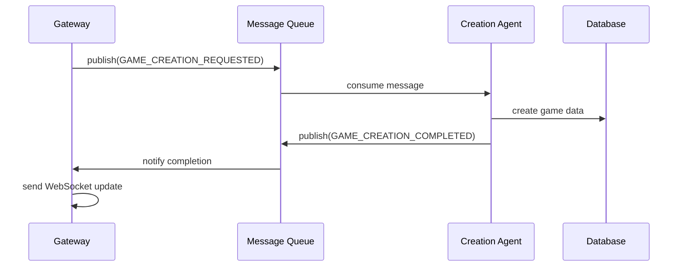
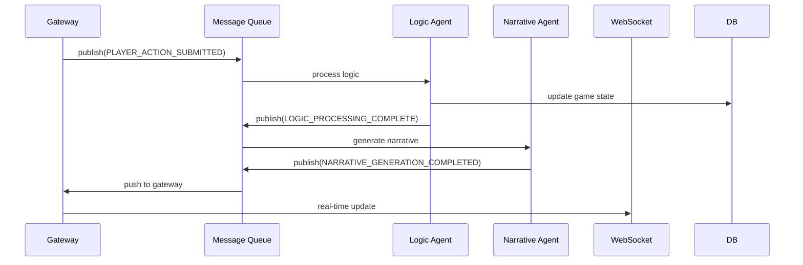

# ADR 002: 事件驱动设计

## 状态

**状态**: 已接受 (Accepted)
**日期**: 2024-11-08
**决策者**: 架构团队

## 上下文

在微服务架构中，服务间的耦合和通信效率是关键问题。传统的同步HTTP调用存在以下挑战：

1. **紧耦合**: 服务间直接依赖，影响独立部署
2. **性能瓶颈**: 同步调用导致的级联延迟
3. **容错性差**: 单个服务故障影响整个调用链
4. **扩展困难**: 难以实现异步业务处理
5. **用户体验**: 长时操作阻塞用户界面

AI推理任务具有以下特性：

- 处理时间不确定（数秒到数十秒）
- 计算资源密集
- 结果需要实时推送给用户
- 失败需要特殊处理机制

## 决策

采用事件驱动架构 (Event-Driven Architecture) 作为微服务间的主要通信模式，使用RabbitMQ作为消息队列基础设施。

## 考虑的选项

### 选项1: 同步HTTP调用 (Synchronous HTTP)

- **优点**: 简单直接、易于理解、事务管理简单
- **缺点**: 紧耦合、性能差、容错性低、用户体验差
- **评估**: 不适合AI推理这类异步任务

### 选项2: 事件驱动架构 (Event-Driven Architecture) ⭐ **已选择**

- **优点**: 松耦合、异步处理、弹性扩展、用户体验好
- **缺点**: 复杂性高、一致性挑战、调试困难
- **评估**: 最适合AI驱动的异步业务场景

### 选项3: Actor模型 (Actor Model)

- **优点**: 并发性好、状态管理清晰
- **缺点**: 学习成本高、生态不成熟
- **评估**: 过于激进，团队学习成本过高

## 事件驱动设计

### 1. 事件类型分类

#### 命令事件 (Command Events)

触发业务操作的事件，期望有明确响应：

```typescript
interface GameCreationRequestedEvent {
  eventId: string;
  userId: string;
  concept: string;
  timestamp: Date;
}
```

#### 领域事件 (Domain Events)

业务状态变更的通知事件：

```typescript
interface GameCreatedEvent {
  eventId: string;
  gameId: string;
  userId: string;
  gameData: Game;
  timestamp: Date;
}
```

#### 集成事件 (Integration Events)

跨服务边界的事件，用于服务间协调：

```typescript
interface LogicProcessingCompletedEvent {
  eventId: string;
  gameId: string;
  userId: string;
  directives: StateChangeDirective[];
  timestamp: Date;
}
```

### 2. 消息队列架构

#### 交换器设计 (Exchange Design)

```
┌─────────────────┐    ┌─────────────────┐
│   Topic         │    │   Direct        │
│   Exchange      │    │   Exchange      │
│                 │    │                 │
│ game.*          │    │ game.created    │
│ logic.*         │    │ logic.completed │
│ narrative.*     │    │ narrative.done  │
└─────────┬───────┘    └─────────┬───────┘
          │                      │
          ▼                      ▼
    ┌─────────────┐        ┌─────────────┐
    │   Queues    │        │   Queues    │
    │             │        │             │
    │ creation_q  │        │ gateway_q   │
    │ logic_q     │        │ frontend_q  │
    │ narrative_q │        │             │
    └─────────────┘        └─────────────┘
```

#### 死信队列设计 (DLQ Design)

```typescript
const queueOptions = {
  durable: true,
  deadLetterExchange: 'dlx',
  deadLetterRoutingKey: 'dlq',
  messageTtl: 24 * 60 * 60 * 1000, // 24小时TTL
};

const dlqOptions = {
  durable: true,
  messageTtl: 7 * 24 * 60 * 60 * 1000, // 7天TTL
};
```

### 3. 事件流设计

#### 游戏创建流程



#### 游戏交互流程



## 消息模式

### 1. 发布-订阅模式 (Pub/Sub)

```typescript
@Injectable()
export class EventBusService {
  async publish(event: string, data: any): Promise<void> {
    await this.redisClient.publish(event, JSON.stringify(data));
  }

  async subscribe(event: string, handler: Function): Promise<void> {
    // 订阅逻辑
  }
}
```

### 2. 请求-响应模式 (Request-Reply)

```typescript
@Injectable()
export class MessageService {
  async sendRequest(queue: string, message: any): Promise<any> {
    const correlationId = uuidv4();
    const replyQueue = await this.createReplyQueue();

    return new Promise((resolve) => {
      this.replyHandlers.set(correlationId, resolve);
      this.channel.sendToQueue(queue, Buffer.from(JSON.stringify({
        ...message,
        correlationId,
        replyTo: replyQueue,
      })));
    });
  }
}
```

### 3. 工作队列模式 (Work Queue)

```typescript
@Injectable()
export class TaskQueueService {
  async enqueueTask(queue: string, task: any): Promise<void> {
    await this.channel.assertQueue(queue, { durable: true });
    this.channel.sendToQueue(queue, Buffer.from(JSON.stringify(task)), {
      persistent: true,
    });
  }

  async processTasks(queue: string, handler: Function): Promise<void> {
    await this.channel.consume(queue, async (msg) => {
      try {
        const task = JSON.parse(msg.content.toString());
        await handler(task);
        this.channel.ack(msg);
      } catch (error) {
        this.channel.nack(msg, false, false); // 发送到DLQ
      }
    });
  }
}
```

## 容错与恢复

### 1. 消息重试策略

```typescript
@Injectable()
export class RetryService {
  async handleRetry(channel: Channel, msg: Message, error: Error): Promise<void> {
    const retryCount = (msg.properties.headers?.['x-retry-count'] || 0) + 1;

    if (retryCount < this.maxRetries) {
      // 指数退避重试
      const delay = Math.pow(2, retryCount) * 1000;
      setTimeout(() => {
        channel.sendToQueue(msg.fields.routingKey, msg.content, {
          headers: { 'x-retry-count': retryCount },
          persistent: true,
        });
      }, delay);
    } else {
      // 发送到死信队列
      channel.sendToQueue('dlq', msg.content, { persistent: true });
    }

    channel.ack(msg);
  }
}
```

### 2. 幂等性保证

```typescript
@Injectable()
export class IdempotencyService {
  async checkIdempotency(key: string, ttl: number = 3600): Promise<boolean> {
    const exists = await this.redisClient.exists(`idempotency:${key}`);
    if (exists) return false;

    await this.redisClient.setex(`idempotency:${key}`, ttl, '1');
    return true;
  }
}
```

### 3. 补偿事务

```typescript
@Injectable()
export class CompensationService {
  async compensate(eventId: string): Promise<void> {
    const event = await this.getEvent(eventId);
    const compensationEvent = this.createCompensationEvent(event);

    await this.eventBus.publish(compensationEvent.type, compensationEvent.data);
  }
}
```

## 监控与可观测性

### 1. 队列指标

- **队列长度**: 实时队列积压情况
- **处理速度**: 每秒处理消息数
- **错误率**: 消息处理失败率
- **延迟**: 消息从入队到处理的时间

### 2. 事件追踪

```typescript
@Injectable()
export class EventTracingService {
  async traceEvent(event: DomainEvent): Promise<void> {
    const traceId = event.traceId || uuidv4();

    await this.logger.log('event_published', {
      eventId: event.eventId,
      eventType: event.constructor.name,
      traceId,
      timestamp: event.timestamp,
      data: event,
    });
  }
}
```

## 实施考虑

### 1. 顺序保证

- **分区键**: 使用游戏ID作为分区键保证顺序
- **单消费者**: 关键业务使用单消费者模式
- **事件版本**: 事件版本控制保证兼容性

### 2. 性能优化

- **批量处理**: 支持消息批量处理
- **连接复用**: RabbitMQ连接池管理
- **消息压缩**: 大消息体压缩传输

### 3. 扩展性

- **动态路由**: 支持运行时路由规则修改
- **插件扩展**: 事件处理插件化
- **多协议**: 支持AMQP、MQTT等多种协议

## 风险评估

### 复杂性风险

- **风险**: 事件驱动增加系统复杂性
- **缓解**: 完善的文档和培训，建立事件目录

### 调试困难

- **风险**: 异步流程难以调试和追踪
- **缓解**: 分布式追踪工具，详细日志记录

### 数据一致性

- **风险**: 最终一致性可能导致业务问题
- **缓解**: 业务层面的一致性检查，补偿机制

## 验收标准

- [x] 事件驱动通信正常
- [x] 异步任务处理稳定
- [x] 死信队列处理完善
- [x] 监控指标完整
- [x] 文档和工具完善

## 相关文档

- [ADR-001: 微服务架构选择](./ADR-001-microservices-choice.md)
- [事件驱动架构详解](../EVENT-DRIVEN-ARCHITECTURE.md)
- [数据架构设计](../DATA-ARCHITECTURE.md)

## 后续影响

此决策影响:

- ADR-004: 消息队列技术选型
- ADR-005: 分布式事务处理
- ADR-006: 实时通信架构
