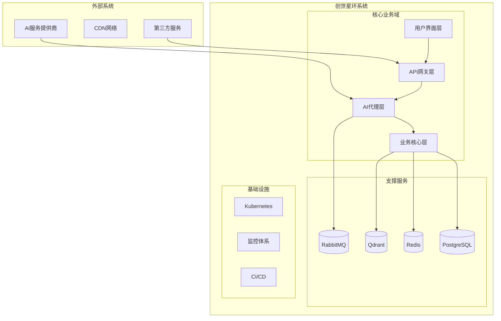
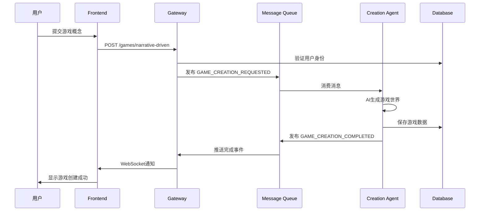
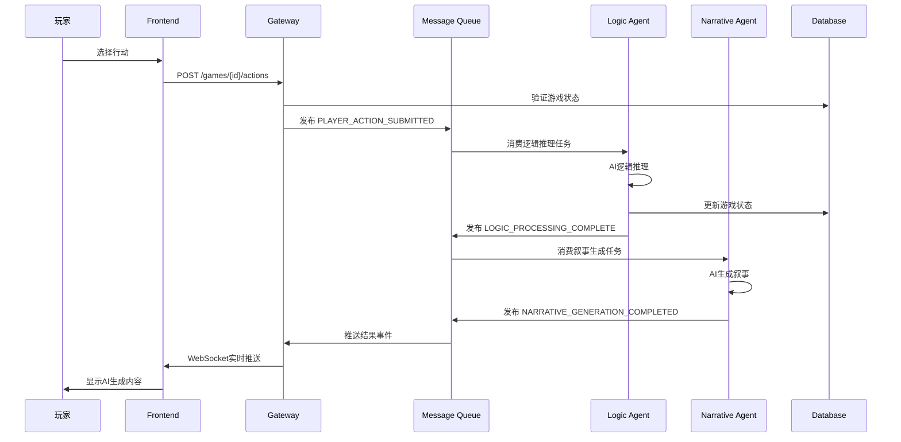

# 🏗️ 系统整体架构设计

## 📋 概述

创世星环是一个基于AI驱动的交互式叙事游戏生成系统，采用现代化的微服务架构设计。本文档描述系统的整体架构设计，包括组件关系、数据流、部署架构等关键方面。

## 🏛️ 架构总览

### 系统边界与上下文



### 架构分层

```
┌─────────────────────────────────────────────────────────────┐
│                    🎨 表现层 (Presentation)                 │
│  Frontend (Vue 3 SPA) + Mobile Apps                        │
├─────────────────────────────────────────────────────────────┤
│                 🏢 应用层 (Application)                     │
│  API Gateway + Business Services + Orchestration           │
├─────────────────────────────────────────────────────────────┤
│                 🤖 领域层 (Domain)                          │
│  Game Core + AI Services + Business Logic                  │
├─────────────────────────────────────────────────────────────┤
│                 🗄️ 基础设施层 (Infrastructure)             │
│  Databases + Message Queues + External Services            │
└─────────────────────────────────────────────────────────────┘
```

## 🧩 核心组件架构

### 1. 用户界面层 (Frontend)

**技术栈**: Vue 3 + TypeScript + Vite
**职责**: 用户交互、状态管理、实时通信
**组件**:

- **主应用 (Main App)**: 单页应用入口
- **游戏界面 (Game UI)**: 游戏交互组件
- **创世中心 (Creation Hub)**: 游戏创建流程
- **插件市场 (Plugin Marketplace)**: 扩展功能管理
- **WebSocket客户端**: 实时通信处理

### 2. API网关层 (Backend Gateway)

**技术栈**: NestJS + TypeScript
**职责**: 请求路由、认证授权、负载均衡、API管理
**组件**:

- **认证服务 (Auth Service)**: JWT令牌管理、用户认证
- **游戏管理 (Games Service)**: 游戏CRUD操作
- **WebSocket网关 (WS Gateway)**: 实时消息路由
- **插件沙箱 (Plugin Sandbox)**: 插件安全执行
- **设置管理 (Settings Service)**: 用户配置管理

### 3. AI代理层 (AI Agents)

**架构模式**: 微服务 + 事件驱动
**职责**: AI推理、业务逻辑处理、异步任务执行
**代理类型**:

#### Creation Agent (创世代理)

- **输入**: 用户概念描述
- **输出**: 完整的游戏世界设定
- **职责**: 从零创建游戏世界

#### Logic Agent (逻辑代理)

- **输入**: 玩家行动 + 游戏状态
- **输出**: 状态变更指令
- **职责**: 处理游戏逻辑推理

#### Narrative Agent (叙事代理)

- **输入**: 逻辑处理结果 + 游戏状态
- **输出**: 生动叙事内容 + 行动选项
- **职责**: 生成沉浸式叙事

#### DLQ Consumer (死信队列消费者)

- **输入**: 失败的消息
- **职责**: 错误处理、告警通知、失败消息管理

### 4. 业务核心层 (Business Core)

**架构模式**: 领域驱动设计 (DDD)
**职责**: 业务规则、领域逻辑、数据一致性
**组件**:

- **Game Core**: 游戏领域模型和规则引擎
- **AI Services**: 多AI提供商抽象层
- **Common Backend**: 共享业务逻辑和基础设施

## 📊 数据流架构

### 请求处理流程



### 游戏交互流程



## 🗄️ 数据架构

### 数据存储策略

#### PostgreSQL (主数据库)

- **用户数据**: 用户账户、认证信息
- **游戏数据**: 游戏实体、世界设定、角色信息
- **业务数据**: 插件配置、用户设置

#### Redis (缓存层)

- **会话存储**: 用户会话和JWT令牌
- **热点数据**: 频繁访问的游戏状态
- **实时数据**: WebSocket连接状态

#### RabbitMQ (消息队列)

- **异步任务**: AI推理任务队列
- **事件总线**: 服务间事件通信
- **死信队列**: 失败任务处理

#### Qdrant (向量数据库)

- **语义搜索**: 对话历史向量检索
- **记忆系统**: AI上下文记忆存储
- **相似性匹配**: 内容推荐和去重

### 数据一致性策略

#### 事务管理

```typescript
// 游戏创建事务示例
await this.prisma.$transaction(async (tx) => {
  // 1. 创建游戏记录
  const game = await tx.game.create({ data: gameData });

  // 2. 创建角色
  await tx.character.create({ data: { gameId: game.id, ... } });

  // 3. 创建世界书条目
  await tx.worldBookEntry.createMany({ data: worldBookData });

  return game;
});
```

#### 最终一致性

- **事件驱动更新**: 通过事件总线实现跨服务数据同步
- **补偿事务**: 失败场景下的数据修复机制
- **审计日志**: 完整的操作记录用于问题排查

## 🔒 安全架构

### 认证授权

#### JWT令牌机制

```typescript
// 令牌生成
const token = await this.jwtService.signAsync({
  sub: user.id,
  email: user.email,
  role: user.role,
})

// 令牌验证中间件
@Injectable()
export class JwtAuthGuard implements CanActivate {
  async canActivate(context: ExecutionContext): Promise<boolean> {
    const token = this.extractTokenFromHeader(request)
    return await this.jwtService.verifyAsync(token)
  }
}
```

#### 多层安全防护

- **API网关**: 请求过滤和限流
- **服务层**: 业务规则验证
- **数据层**: 敏感数据加密

### AI安全

#### 护栏机制 (Guardrails)

- **输入验证**: 防止恶意输入
- **输出过滤**: 过滤不当内容
- **使用监控**: API调用配额管理

#### 隐私保护

- **数据最小化**: 只收集必要数据
- **加密存储**: 敏感数据加密
- **访问控制**: 基于角色的数据访问

## ⚡ 性能架构

### 性能指标目标

| 指标          | 目标值 | 说明       |
| ------------- | ------ | ---------- |
| API响应时间   | <200ms | 90%请求    |
| 游戏创建时间  | <30s   | AI生成耗时 |
| 并发用户数    | 1000+  | 同时在线   |
| WebSocket延迟 | <100ms | 实时通信   |

### 性能优化策略

#### 缓存策略

```typescript
@Injectable()
export class CacheService {
  @Cache('game:state', 300) // 5分钟TTL
  async getGameState(gameId: string): Promise<GameState> {
    return await this.prisma.game.findUnique({ where: { id: gameId } })
  }
}
```

#### 异步处理

- **消息队列**: 解耦同步请求
- **事件驱动**: 非阻塞业务处理
- **后台任务**: AI推理异步执行

#### 数据库优化

- **索引策略**: 基于查询模式的索引
- **连接池**: 复用数据库连接
- **读写分离**: 读请求分流

## 🚀 部署架构

### 容器化部署

```dockerfile
# 多阶段构建示例
FROM node:18-alpine AS builder
WORKDIR /app
COPY package*.json ./
RUN npm ci --only=production

FROM node:18-alpine AS runtime
WORKDIR /app
COPY --from=builder /app/node_modules ./node_modules
COPY dist ./dist
EXPOSE 3000
CMD ["node", "dist/main.js"]
```

### Kubernetes部署

```yaml
apiVersion: apps/v1
kind: Deployment
metadata:
  name: backend-gateway
spec:
  replicas: 3
  selector:
    matchLabels:
      app: backend-gateway
  template:
    metadata:
      labels:
        app: backend-gateway
    spec:
      containers:
        - name: backend-gateway
          image: creation-ring/backend-gateway:latest
          ports:
            - containerPort: 3000
          env:
            - name: NODE_ENV
              value: 'production'
          resources:
            requests:
              memory: '256Mi'
              cpu: '200m'
            limits:
              memory: '512Mi'
              cpu: '500m'
```

### 服务网格架构

```
┌─────────────────────────────────────────────────────────────┐
│                    Service Mesh (Istio)                     │
│                                                             │
│  ┌─────────────┐ ┌─────────────┐ ┌─────────────────────┐   │
│  │  Frontend   │ │  Gateway    │ │   AI Agents         │   │
│  │  Service    │ │  Service    │ │   Services          │   │
│  └─────────────┘ └─────────────┘ └─────────────────────┘   │
│           │               │                       │         │
│           └───────────────┼───────────────────────┘         │
│                           │                                 │
│                 ┌─────────┼─────────┐                       │
│                 │  Envoy Proxy     │                       │
│                 │  Sidecar         │                       │
│                 └───────────────────┘                       │
│                           │                                 │
│                 ┌─────────┼─────────┐                       │
│                 │ Control Plane     │                       │
│                 │ (Pilot + Citadel) │                       │
│                 └───────────────────┘                       │
└─────────────────────────────────────────────────────────────┘
```

## 📊 监控架构

### 可观测性三柱

#### 指标 (Metrics)

- **业务指标**: 请求量、成功率、响应时间
- **系统指标**: CPU、内存、磁盘使用率
- **自定义指标**: AI推理耗时、队列积压

#### 日志 (Logs)

```typescript
@Injectable()
export class LoggerService {
  log(level: LogLevel, message: string, context?: any): void {
    const logEntry = {
      timestamp: new Date().toISOString(),
      level,
      message,
      context,
      service: this.serviceName,
    }

    // 结构化日志输出
    console.log(JSON.stringify(logEntry))
  }
}
```

#### 追踪 (Traces)

- **请求追踪**: 分布式请求链路追踪
- **性能剖析**: AI推理性能分析
- **错误追踪**: 异常堆栈和上下文

### 监控工具栈

```
应用层监控: Sentry (错误追踪)
基础设施监控: Prometheus + Grafana
日志聚合: ELK Stack (Elasticsearch + Logstash + Kibana)
分布式追踪: Jaeger
性能监控: New Relic / DataDog
```

## 🔄 扩展架构

### 水平扩展策略

#### 无状态服务扩展

```yaml
apiVersion: autoscaling/v2
kind: HorizontalPodAutoscaler
metadata:
  name: ai-agent-hpa
spec:
  scaleTargetRef:
    apiVersion: apps/v1
    kind: Deployment
    name: ai-agent
  minReplicas: 2
  maxReplicas: 10
  metrics:
    - type: Resource
      resource:
        name: cpu
        target:
          type: Utilization
          averageUtilization: 70
```

#### 队列驱动扩展

- **基于队列长度**: 消息积压时自动扩展
- **预测性扩展**: 基于历史模式预测负载
- **时间窗口扩展**: 业务高峰期主动扩展

### 垂直扩展策略

#### 资源优化

- **容器资源限制**: 合理设置CPU和内存限制
- **JVM调优**: Node.js内存和垃圾回收优化
- **数据库连接池**: 优化数据库连接管理

## 🧪 测试架构

### 测试金字塔

```
┌─────────────────────────────────────────────────────────────┐
│                    E2E Tests (端到端测试)                    │
│              完整用户流程，业务验收测试                    │
├─────────────────────────────────────────────────────────────┤
│                 Integration Tests (集成测试)               │
│              服务间交互，数据一致性测试                    │
├─────────────────────────────────────────────────────────────┤
│                  Unit Tests (单元测试)                      │
│              函数/方法级，逻辑正确性测试                   │
├─────────────────────────────────────────────────────────────┤
│                 Component Tests (组件测试)                 │
│              UI组件，交互逻辑测试                          │
└─────────────────────────────────────────────────────────────┘
```

### 测试环境架构

```
┌─────────────────────────────────────────────────────────────┐
│                    测试环境矩阵                             │
│                                                             │
│  ┌─────────────┐ ┌─────────────┐ ┌─────────────────────┐   │
│  │   Unit      │ │ Integration │ │   E2E Testing       │   │
│  │   Tests     │ │   Tests     │ │   Environment       │   │
│  └─────────────┘ └─────────────┘ └─────────────────────┘   │
│          │                   │                   │          │
│          └───────────────────┼───────────────────┘          │
│                              │                              │
│                 ┌────────────┼────────────┐                 │
│                 │   Test     │   Data     │                 │
│                 │   Services │   Mocks    │                 │
│                 └────────────┴────────────┘                 │
│                              │                              │
│                 ┌────────────┼────────────┐                 │
│                 │   Test     │   CI/CD    │                 │
│                 │   Runners  │   Pipeline │                 │
│                 └────────────┴────────────┘                 │
└─────────────────────────────────────────────────────────────┘
```

## 📈 演进规划

### Phase 1: 核心架构 (当前) ✅

- 微服务架构搭建
- 基础AI代理实现
- 事件驱动通信
- 容器化部署

### Phase 2: 高级架构 🚧

- 服务网格集成 (Istio)
- CQRS + 事件溯源
- 多区域部署
- 智能化监控

### Phase 3: 云原生架构 📋

- Serverless函数
- Edge Computing
- AI模型分布式推理
- 联邦学习支持

### Phase 4: 自适应架构 🎯

- 自动扩展和优化
- AI驱动的架构决策
- 自愈和自配置
- 预测性维护

## 📚 相关文档

- [微服务架构详解](./MICROSERVICES-ARCHITECTURE.md)
- [数据架构设计](./DATA-ARCHITECTURE.md)
- [部署架构](./DEPLOYMENT-ARCHITECTURE.md)
- [架构决策记录](./ADRs/)

---

**📝 维护说明**: 系统架构演进时请同步更新此文档
