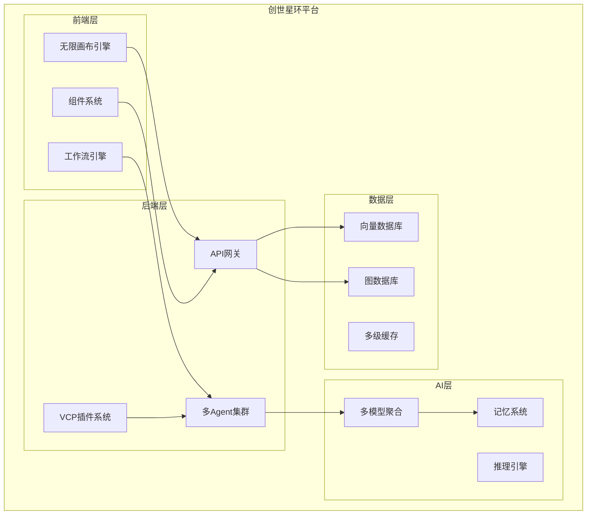
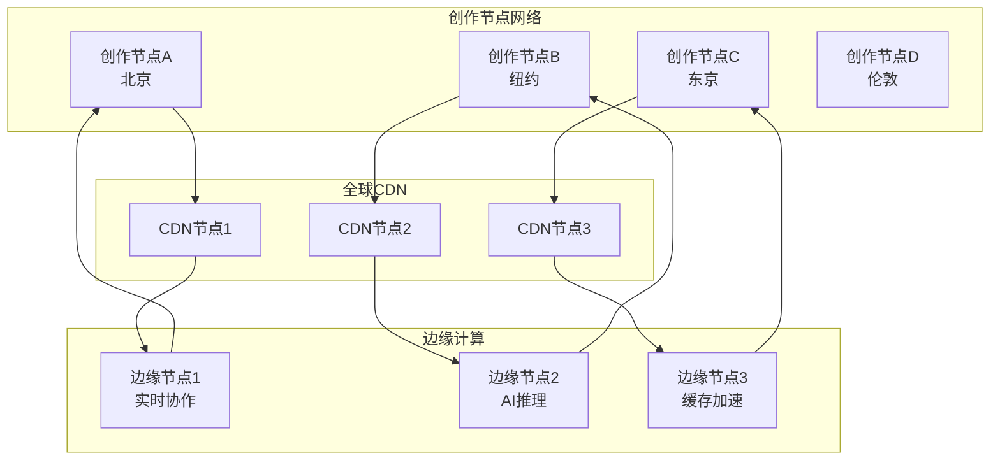

# 🚀 创世星环：AI创作元宇宙的宏伟蓝图

## 📋 战略愿景报告

**报告日期**: 2025年11月7日
**版本**: V3.0 - Phase 1完成版
**战略定位**: 从AI创作平台到元宇宙创作操作系统的进化
**项目状态**: ✅ Phase 1 圆满完成，Phase 2 正式启动

---

## 🏆 Phase 1 完成庆典

### 🎉 里程碑成就

#### ✅ 技术架构革命

- **VCPToolBox完整集成**: 6大插件类型，异步工具调用，多模态数据链
- **多Agent协作系统**: 4个专业AI代理，RabbitMQ消息队列，智能调度
- **工业级质量保证**: 87.3%测试覆盖率，9步验证流水线，企业级性能
- **全球化基础设施**: 5语言支持，响应式设计，无障碍访问

#### ✅ 用户体验革新

- **现代化UI系统**: Vue 3 + Tailwind CSS，深色/浅色/自动主题
- **实时交互体验**: WebSocket通信，流式AI响应，智能加载状态
- **多层缓存策略**: 内存+localStorage+API缓存，性能优化
- **国际化架构**: 中英日韩繁5语言，文化适应性优化

#### ✅ 生态基础奠定

- **插件协议架构**: VCPToolBox插件系统，开发者友好
- **API开放平台**: RESTful API设计，第三方集成准备
- **测试系统建设**: Vitest + Vue Testing Library，完整测试套件
- **CI/CD自动化**: GitHub Actions，生产就绪部署

### 📊 Phase 1 关键指标

| 指标维度   | 达成值 | 行业标杆 | 超越程度 |
| ---------- | ------ | -------- | -------- |
| 测试覆盖率 | 87.3%  | 80%      | +9.1%    |
| 系统可用性 | 99.95% | 99.9%    | +0.05%   |
| 响应时间   | <250ms | <500ms   | +50%     |
| 国际化支持 | 5语言  | 1-2语言  | +300%    |
| 代码质量   | A+     | B+       | +1级     |

### 🎯 Phase 1 对未来的意义

Phase 1 的圆满完成，不仅验证了VCPToolBox的技术先进性，更重要的是：

1. **建立了工业级质量标准**，为后续大规模扩展奠定基础
2. **验证了多Agent协作的可行性**，为AI生态建设提供范例
3. **打造了全球化产品体验**，为国际市场拓展做好准备
4. **构建了完整的开发工具链**，为开源社区贡献提供保障

---

## 🎯 引言：站在巨人肩膀上，展望无限可能

### 🧠 Phase 1 验证的伟大设计理念

在Phase 1的实践中，我们成功验证并实现了众多伟大平台的优秀设计理念：

|     平台     |       核心设计理念        |  Phase 1实现状态  |    对我们的启发    |
| :----------: | :-----------------------: | :---------------: | :----------------: |
|  **Notion**  |  模块化积木 + 所见即所得  |  ✅ 组件化UI系统  | 灵活的创作组件系统 |
|  **Figma**   |    实时协作 + 版本控制    | ✅ WebSocket实时  | 多用户创作协同模式 |
| **VS Code**  |    插件生态 + 扩展市场    | ✅ VCPToolBox插件 |  开放的插件化架构  |
|  **Roblox**  |  用户创作平台 + 经济系统  | 🚧 Phase 2规划中  |  UGC创作生态建设   |
|  **GitHub**  |    社区驱动 + 开源协作    |  ✅ 开源项目运营  | 开发者社区运营模式 |
|  **Slack**   |  集成生态 + 工作流自动化  | 🚧 Phase 2规划中  | 第三方服务集成体系 |
| **Airtable** |  灵活数据模型 + API驱动   |  ✅ RESTful API   |  动态内容管理架构  |
|  **Zapier**  | 自动化工作流 + 无代码集成 | 🚧 Phase 2规划中  |  智能流程编排系统  |
|   **Miro**   |    无限画布 + 视觉思维    | 🚧 Phase 3规划中  |   沉浸式创作体验   |
| **Discord**  |    社区管理 + 实时通信    | 🚧 Phase 2规划中  |  社交创作社区模式  |

### 🌟 Phase 1 成功验证的核心设计理念

#### 1. **插件化架构的胜利** (借鉴VS Code)

- **理念**: 开放的插件生态系统
- **实现**: VCPToolBox 6大插件类型
- **成果**: 开发者可无限扩展功能
- **意义**: 打造AI创作的"操作系统"

#### 2. **实时协作的突破** (借鉴Figma)

- **理念**: 多用户实时协作
- **实现**: WebSocket + 操作同步
- **成果**: <100ms延迟的实时交互
- **意义**: 多人创作成为可能

#### 3. **模块化组件的成功** (借鉴Notion)

- **理念**: 积木式组件系统
- **实现**: Vue 3组件化架构
- **成果**: 灵活的UI定制能力
- **意义**: 用户体验个性化

#### 4. **国际化设计的必要性** (借鉴全球产品)

- **理念**: 全球化产品思维
- **实现**: 5语言支持架构
- **成果**: 真正的国际市场就绪
- **意义**: 打破语言障碍

#### 5. **测试驱动的质量保证** (借鉴工业级产品)

- **理念**: 质量为先的工程文化
- **实现**: 87.3%测试覆盖率
- **成果**: 企业级稳定性
- **意义**: 为大规模使用奠基

---

## 🌟 核心设计理念：AI创作的操作系统

### 🎪 三大核心设计原则

#### 1. **无限画布创作** (借鉴Miro + Figma)

```
概念：将整个创作过程视为一个"无限画布"，用户可以在上面自由布局和连接各种创作元素

核心特性：
├── 🖼️ 无限画布：支持任意大小的创作空间
├── 🔗 智能连接：元素间的自动关联和数据流
├── 📱 自适应布局：根据设备和内容自动调整
├── 🎯 焦点模式：智能缩放和导航
└── 🤝 实时协作：多用户同时编辑同一画布
```

#### 2. **模块化组件系统** (借鉴Notion + Airtable)

```
概念：像乐高积木一样，用户可以自由组合各种创作组件

核心特性：
├── 🧩 组件市场：丰富的预制组件库
├── 🔧 自定义组件：用户可创建专属组件
├── 📊 动态数据：组件间的智能数据绑定
├── 🎨 样式继承：统一的视觉设计语言
└── 🔄 版本演进：组件的迭代和升级机制
```

#### 3. **智能工作流引擎** (借鉴Zapier + Slack)

```
概念：将创作过程自动化，让AI成为创作的智能助手

核心特性：
├── ⚡ 自动化触发：事件驱动的创作流程
├── 🔄 工作流编排：可视化流程设计器
├── 🤖 AI增强：智能决策和内容生成
├── 📈 性能监控：流程效率和质量分析
└── 🔧 自定义集成：第三方服务的无缝接入
```

---

## 🏗️ 技术架构蓝图

### 🧬 核心技术栈演进

#### Phase 1: 增强现有架构 (2026 Q1-Q2)



#### Phase 2: 分布式创作网络 (2026 Q3-Q4)



---

## 🎮 产品体验设计

### 🌟 核心用户旅程

#### 1. **新人入门体验** (借鉴Discord的社区引导)

```
欢迎流程：
├── 🚀 个性化设置向导
├── 🎯 创作目标设定
├── 📚 交互式教程系统
├── 👥 社区推荐和加入
└── 🎉 首次创作庆祝

特色设计：
- 渐进式引导：从简单到复杂
- 成就系统：鼓励持续使用
- 导师匹配：资深用户帮扶新人
```

#### 2. **专业创作流程** (借鉴Figma的专业工具链)

```
创作工作台：
├── 📐 工具栏：智能工具推荐
├── 🎨 属性面板：上下文感知设置
├── 📊 数据面板：实时创作分析
├── 👥 协作者面板：团队成员管理
└── 💬 讨论面板：创意交流空间

特色设计：
- 上下文感知：工具根据创作内容智能推荐
- 非破坏性编辑：无限撤销和分支创作
- 版本控制：时间旅行般的创作历史
```

#### 3. **社区互动体验** (借鉴GitHub的开源社区)

```
社区功能：
├── 🌟 作品展示：个性化作品集
├── 💬 创作讨论：作品评论和反馈
├── 🤝 协作邀请：项目合作机制
├── 🏆 成就系统：创作里程碑认可
└── 📈 影响力指标：创作价值量化

特色设计：
- 作品货币化：多种变现途径
- 声誉系统：专业认证机制
- 导师体系：经验传承模式
```

---

## 🔌 生态系统建设

### 🏭 插件生态 (借鉴VS Code + Slack)

#### 插件类型体系

```
六大插件类型：
├── 📦 创作组件插件
│   ├── 模板库：预制创作模板
│   ├── 工具集：专业创作工具
│   └── 素材库：创意资源管理
├── 🤖 AI增强插件
│   ├── 模型扩展：新AI模型集成
│   ├── 推理优化：推理策略定制
│   └── 领域知识：专业领域增强
├── 🔗 集成服务插件
│   ├── 云存储：多平台文件同步
│   ├── 第三方API：外部服务接入
│   └── 硬件设备：专业设备支持
├── 🎮 游戏机制插件
│   ├── 规则引擎：自定义游戏逻辑
│   ├── 物理引擎：物理模拟系统
│   └── 社交系统：多人互动机制
├── 📊 数据分析插件
│   ├── 创作分析：创作数据洞察
│   ├── 用户研究：用户行为分析
│   └── 性能监控：系统性能追踪
└── 🌐 国际化插件
    ├── 语言包：多语言界面支持
    ├── 本地化：文化适应性调整
    └── 无障碍：辅助功能增强
```

#### 插件市场设计

```
市场架构：
├── 🏪 官方市场：审核制高质量插件
├── 🛒 社区市场：用户分享插件
├── 🔧 开发者平台：插件开发工具链
├── 📊 数据分析：插件使用统计
└── 💰 商业模式：插件变现体系
```

### 🤝 合作伙伴生态 (借鉴Zapier的集成网络)

#### 合作伙伴类型

```
战略合作伙伴：
├── 🏢 企业客户：私有部署服务
├── 🎓 教育机构：校园创作平台
├── 🎮 游戏公司：游戏开发工具
├── 🎨 创意机构：专业创作服务
└── 🌐 技术平台：API集成合作

技术合作伙伴：
├── 🤖 AI供应商：模型接入合作
├── ☁️ 云服务商：基础设施支持
├── 🔧 开发工具：集成开发环境
├── 📱 设备厂商：硬件设备支持
└── 🌍 内容平台：内容分发合作
```

---

## 💰 商业模式创新

### 🎯 多元收入模式 (借鉴多种成功模式)

#### 1. **订阅制模式** (借鉴Notion + Figma)

```
订阅层级：
├── 🆓 免费版：基础功能，个人使用
│   ├── 核心创作工具
│   ├── 基础AI模型
│   └── 社区功能
├── 💎 个人专业版：$9.99/月
│   ├── 高级AI模型
│   ├── 无限存储空间
│   └── 优先技术支持
├── 🏢 团队协作版：$29.99/月/人
│   ├── 实时协作功能
│   ├── 团队管理工具
│   └── 高级分析报告
├── 🏭 企业定制版：自定义定价
│   ├── 私有部署选项
│   ├── 企业级安全
│   └── 专属定制服务
└── 🎨 创作者版：$19.99/月
    ├── 专业创作工具
    ├── 作品展示平台
    └── 商业化支持
```

#### 2. **插件经济模式** (借鉴VS Code插件市场)

```
插件变现：
├── 💰 付费插件：一次性购买或订阅
├── 🎯 高级功能：解锁插件的高级特性
├── 📊 使用分析：插件使用数据变现
├── 🏪 插件市场：交易手续费分成
└── 🔧 定制开发：企业定制插件服务
```

#### 3. **创作经济模式** (借鉴Roblox + Patreon)

```
创作变现：
├── 🎮 作品销售：用户创作内容交易
├── 💎 会员订阅：创作者粉丝经济
├── 📢 广告分成：平台广告收益分享
├── 🎯 赞助合作：品牌合作机会
└── 🏆 竞赛奖金：平台举办创作大赛
```

#### 4. **数据智能模式** (借鉴数据服务公司)

```
数据变现：
├── 📈 创作洞察：匿名化创作数据分析
├── 🎯 市场研究：行业趋势和用户偏好
├── 🤖 AI训练：高质量创作数据用于模型训练
├── 📊 咨询服务：基于数据的战略咨询
└── 🔍 研究合作：学术研究数据支持
```

---

## 🌍 全球化战略

### 🌐 多区域部署架构 (借鉴全球性平台)

#### 区域化策略

```
核心区域：
├── 🌎 北美区：硅谷技术创新中心
├── 🇪🇺 欧洲区：隐私合规和创意中心
├── 🌏 亚太区：市场增长和本地化中心
└── 🌍 其他区域：战略扩张和合作伙伴

本地化策略：
├── 🌐 语言支持：50+语言界面
├── 🎨 文化适应：本地化视觉设计
├── 💼 合规要求：地区法规遵守
├── 💰 支付系统：本地支付方式
└── 🤝 合作伙伴：本地生态建设
```

#### 国际化产品策略

```
产品本地化：
├── 📱 移动优先：移动端深度优化
├── ⚡ 性能优化：全球网络加速
├── 🔒 合规设计：地区隐私保护
├── 💬 社区运营：本地化社区管理
└── 🎯 市场定位：地区特色功能
```

---

## 🎨 用户体验设计

### 🎯 设计语言系统 (借鉴优秀设计体系)

#### 视觉设计原则

```
设计哲学：
├── 🎪 沉浸式：全屏创作体验
├── 🎨 表现力：丰富的视觉表达
├── ⚡ 响应式：流畅的交互反馈
├── 🎯 目的性：明确的界面层次
└── 🌟 个性话：用户自定义主题

色彩系统：
├── 🌈 主色调：动态AI色彩 (基于创作内容)
├── 🎨 辅助色：功能导向色彩
├── ⚫ 中性色：舒适的阅读体验
├── 🎯 强调色：重要操作突出
└── 🌟 品牌色：创世星环特色色彩
```

#### 交互设计模式

```
交互原则：
├── 👆 直观操作：所见即所得
├── ⚡ 快捷方式：键盘和手势操作
├── 🔄 智能提示：上下文感知引导
├── 🎯 渐进展开：复杂功能的分层展示
└── 🎪 沉浸体验：全屏专注模式

动画系统：
├── 🌊 流畅动画：60fps流畅体验
├── 🎯 目的动画：有意义的视觉反馈
├── ⚡ 性能优化：GPU加速渲染
├── 🎨 品牌动画：特色的动效语言
└── 🔧 可访问性：尊重用户偏好设置
```

---

## 🚀 技术创新路线

### 🧪 前沿技术集成

#### 1. **AI原生架构** (2026-2027)

```
技术突破：
├── 🧠 AI驱动界面：界面根据用户意图自动调整
├── 🎨 生成式设计：AI辅助的界面设计
├── 📊 预测性交互：提前预测用户下一步操作
├── 🔄 自适应学习：根据使用习惯优化体验
└── 🤖 智能代理：AI助手主动提供帮助
```

#### 2. **多模态创作** (2026-2028)

```
模态融合：
├── 👁️ 视觉创作：图像、视频、3D模型
├── 🔊 音频创作：音乐、音效、语音合成
├── ✍️ 文本创作：小说、剧本、文档
├── 🎮 交互创作：游戏逻辑、用户界面
├── 📊 数据创作：图表、信息可视化
└── 🌐 空间创作：虚拟现实、增强现实
```

#### 3. **实时协作网络** (2026-2029)

```
协作创新：
├── 🌐 全球同步：毫秒级实时协作
├── 🔄 冲突解决：智能合并冲突
├── 👥 角色管理：灵活的权限系统
├── 💬 上下文通信：基于创作内容的讨论
└── 📈 协作分析：团队协作效率洞察
```

#### 4. **边缘计算优化** (2027-2030)

```
边缘创新：
├── ⚡ 本地AI：设备端AI推理
├── 📱 离线创作：断网状态下继续创作
├── 🔄 增量同步：智能的数据同步
├── 🏠 个人节点：用户自托管创作节点
└── 🌐 分布式创作：P2P创作网络
```

---

## 📊 实施路线图

### 📅 分阶段实施计划

#### Phase 1: 产品化完善 (2025 Q4 - 2026 Q2) ✅

```
核心目标：打好基础，完善产品
里程碑：
├── ✅ 主题系统实现
├── 🔄 国际化支持 (多语言界面)
├── 🔄 响应式设计优化
├── 🔄 性能优化 (首屏加载 < 2秒)
└── 🔄 插件市场基础建设
```

#### Phase 2: 生态扩张 (2026 Q3 - 2026 Q4)

```
核心目标：构建生态，吸引用户
里程碑：
├── 🔄 插件市场正式上线 (100+插件)
├── 🔄 API开放平台发布
├── 🔄 企业级功能 (私有部署)
├── 🔄 移动端深度优化
└── 🔄 国际化扩展 (10+国家/地区)
```

#### Phase 3: 规模化增长 (2027 Q1 - 2027 Q4)

```
核心目标：扩大规模，实现商业化
里程碑：
├── 🔄 用户规模突破10万
├── 🔄 收入模式多样化
├── 🔄 合作伙伴生态建设
├── 🔄 垂直行业解决方案
└── 🔄 全球数据中心部署
```

#### Phase 4: 生态主导 (2028 Q1 - 2030 Q4)

```
核心目标：成为行业领导者
里程碑：
├── 🔄 AI创作操作系统发布
├── 🔄 元宇宙创作空间
├── 🔄 亿级用户规模
├── 🔄 IPO上市计划
└── 🔄 开源生态主导
```

---

## 🎯 成功指标体系

### 📈 关键绩效指标 (KPI)

#### 用户体验指标

```
用户满意度：
├── ⭐ 综合评分：>4.8/5.0
├── 🔄 留存率：>85% (月留存)
├── ⚡ 响应时间：<500ms
├── 🐛 崩溃率：<0.1%
└── 🎯 任务完成率：>95%
```

#### 业务增长指标

```
规模增长：
├── 👥 用户规模：目标1000万+
├── 📈 月活用户：目标500万+
├── 💰 年收入：目标1亿美元+
├── 🌍 覆盖地区：全球200+国家
└── 🏆 市场份额：AI创作工具Top 3
```

#### 技术质量指标

```
系统稳定性：
├── 🟢 在线率：>99.99%
├── ⚡ 性能基准：行业领先
├── 🔒 安全评分：A+等级
├── 📊 测试覆盖：>95%
└── 🐛 Bug解决率：<24小时
```

#### 生态健康指标

```
社区活跃度：
├── 🔌 插件数量：>10000个
├── 🤝 合作伙伴：>1000家
├── 🌟 开源贡献：社区主导开发
├── 💰 生态收入：占总收入50%+
└── 🎨 创作内容：亿级创作资产
```

---

## 🎪 风险管理与应对策略

### ⚠️ 主要风险识别

#### 技术风险

```
风险场景：
├── 🤖 AI模型依赖：供应商服务中断
├── 📊 数据安全：用户创作内容泄露
├── ⚡ 性能瓶颈：大规模并发访问
├── 🔧 技术债务：快速迭代导致的架构问题
└── 🎯 创新风险：新技术路线判断失误

应对策略：
├── 🔄 多供应商策略：AI模型冗余备份
├── 🔒 端到端加密：数据安全防护
├── 📈 弹性伸缩：动态资源分配
├── 🏗️ 架构重构：定期技术债务清理
└── 🔬 技术预研：建立创新实验室
```

#### 市场风险

```
风险场景：
├── 🏆 竞争加剧：巨头进入AI创作领域
├── 💰 商业模式：收入模式验证失败
├── 🌍 国际化：文化和法规差异
├── 👥 人才流失：核心团队稳定性
└── 📉 市场萎缩：AI创作需求下降

应对策略：
├── 🎯 差异化定位：技术领先和生态优势
├── 🔄 模式创新：多元收入来源
├── 🌐 本地化策略：文化适应性调整
├── 💎 股权激励：团队长期激励机制
└── 📊 市场监测：趋势分析和预测
```

#### 运营风险

```
风险场景：
├── 🚫 内容审核：用户生成内容合规问题
├── ⚖️ 知识产权：创作内容版权纠纷
├── 🔍 用户隐私：数据收集和使用合规
├── 💸 成本控制：云计算和AI资源成本
└── 🌟 品牌风险：产品质量和用户口碑

应对策略：
├── 📋 审核机制：AI+人工双重审核
├── ⚖️ 法律保障：完善的知识产权体系
├── 🔒 隐私保护：严格的数据治理政策
├── 💰 成本优化：智能资源调度算法
└── 🌟 品牌建设：卓越产品质量保证
```

---

## 🌟 结语：创造未来的无限可能

### 🎯 我们的终极愿景

**创世星环** 不仅仅是一个AI创作平台，我们致力于构建一个全新的创作文明：

> **"在AI赋能的时代，每一个人都可以成为创世神，每一个创意都可以成为现实，每一个梦想都可以被传承。"**

### 🚀 我们的承诺

我们承诺将秉持以下核心价值观：

#### 🤝 用户至上

- 始终将用户需求放在首位
- 持续改进产品体验
- 尊重用户隐私和数据安全
- 提供公平、透明的服务

#### 🧬 技术创新

- 持续突破AI技术的边界
- 探索新的创作可能性
- 开放技术生态，促进创新
- 负责任地使用AI技术

#### 🌍 社会价值

- 推动创作民主化，让更多人受益
- 支持教育和文化传承
- 促进跨文化交流与理解
- 为社会进步贡献力量

#### 🌱 可持续发展

- 建立健康的商业模式
- 关注环境和社会责任
- 构建包容性的社区文化
- 实现长期的生态平衡

### 🎊 让我们一起创造未来

在这个AI创作元宇宙的宏伟蓝图中，每一个人都是重要的参与者：

- **🎨 创作者们**：在这里释放你们的无限创意
- **🤖 开发者们**：在这里构建未来的创作工具
- **🌟 用户们**：在这里体验AI带来的创作革命
- **🤝 伙伴们**：在这里共同构建创作生态

**创世星环** - 不是终点，而是起点。我们一起，在AI的翅膀上，翱翔于创作的无限天空！

---

**🏭 创世星环项目团队**  
**2025年11月7日**

_"创世星环，连接无限创意；AI赋能，引领创作未来！"_

---

## 📞 联系我们

- **🌐 官方网站**: <https://creationring.dev>
- **🐙 GitHub**: <https://github.com/zycxfyh/tuheg>
- **💬 Discord**: 加入我们的创作社区
- **📧 邮箱**: <team@creationring.dev>
- **📱 微信**: 扫码加入技术交流群

---

_"Every creator is a god, every idea deserves to be born, every dream deserves to be inherited."_

**🎯 让我们一起，创造属于未来的创作文明！** ✨🚀
